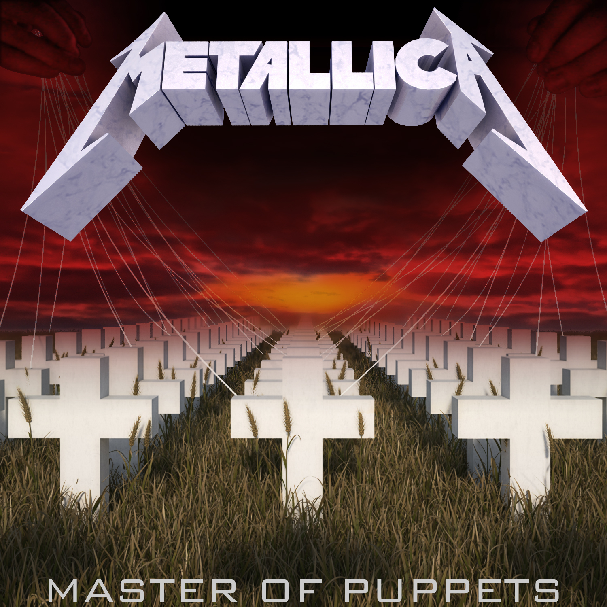

<!DOCTYPE html>
<html lang="ru">
<head>
    <meta charset="UTF-8">
    <title>Master of Puppets</title>
    
</head>
<body>
    

        
        <audio id="player" src="Metallica_-_Master_Of_Puppets.mp3" controls></audio>
    

    
</body>
</html>
